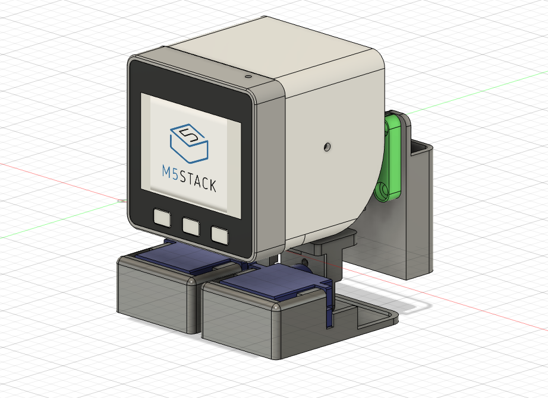
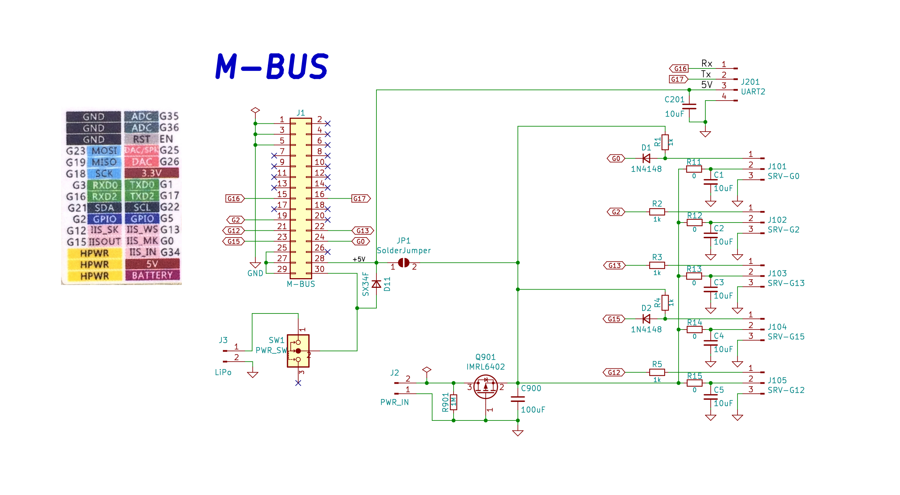

# M5Stack_Walk-chan
A bipedal robot built with M5Stack

## 3D Model
[3D Model](3Ddata/)

## PCB for SG90
[gerber](pcb/)

## Sample Code
[Sample sketch](examples/)

## note
https://note.com/tomorrow56/n/nf83f81b76e1e

## Printables
https://www.printables.com/model/687241-m5stack-walk-chan
